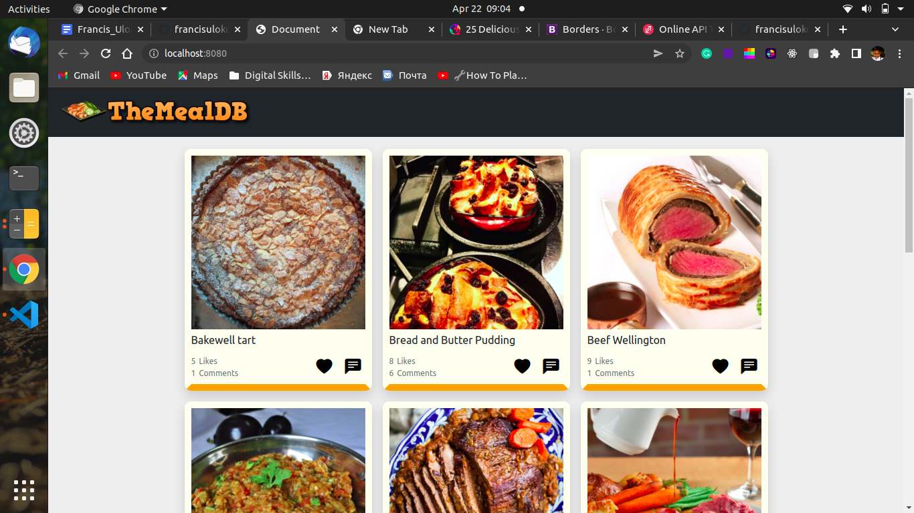
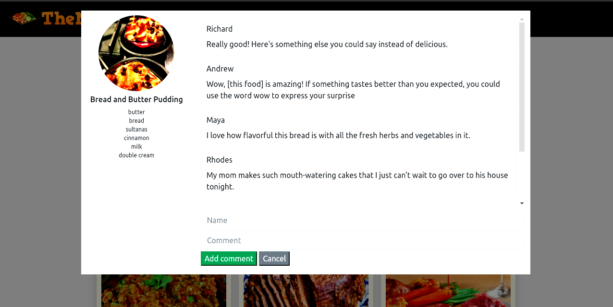

# javascript-capstone

> JavaScript Capstone Project to Build an API-based Web App
[Collaborative Project]

This is a collaborative capstone proeject where the team is tasked to build a web app that displays list of food items form The Meals DB API and create and display Usedr reactions such Like and Comment using Microverse Involvement API.

In this project, we have:

- Used JavaScript to make websites dynamic and build basic single  page apps.
- Used ES6 syntax.
- Used ES6 modules.
- Used callbacks and promises.
- Used webpack.
- Applied JavaScript best practices and language style guides in code.
- Used AAA pattern for unit tests.
- Wrote units tests for a JavaScript app.
- Follow Gitflow.
- Solved simple git conflicts.
- Sent and receive data from an API.
- Used API documentation.
- Understood and Used JSON.
- Made JavaScript code synchronous.
- Performed a code review for a team member.

## Live Demo
Click [here](https://francisuloko.github.io/delicacies/dist/) to visit the app

## Video Link
[Youtube Link](https://youtu.be/9pukR3Mrl68)

## Built With

- JavaScript
- HTML & CSS
- webpack@5.44.0
- ES6
- bootstrap 5
- The Meals DB API

## API 
- [The Meals DB API](https://www.themealdb.com/api.php)
- [Microverse Involment API](https://www.notion.so/microverse/Involvement-API-869e60b5ad104603aa6db59e08150270)

## Prerequisites

- `browser`
- `vscode`
- `git`
- `jest`

## Clone Repo

To get a local copy up and running follow these simple steps:

   - `Open terminal Ctrl + Alt + T`

   - `git clone git@github.com:francisuloko/javascript-capstone.git`

   - `cd javascript-capstone`

   - `npm install`

   - `npm start`

   - `visit localhost:8080`

## Run the tests

- Install jest using yarn `yarn add --dev jest`
- Or install using npm `npm install --save-dev jest`
- Add the following section to your package.json: 
`{
  "scripts": {
    "test": "jest"
  }
}`
- How to run the tests: `npm run test` or `yarn test`
   

## Author

👤 **Ijay Abby**
- GitHub: [@IjayAbby](https://github.com/IjayAbby)
- Twitter: [@Ijay_js](https://twitter.com/Ijay_js)
- LinkedIn: [Abigael Nyangasi](https://www.linkedin.com/in/ijayabby4/)

👤 **Francis Uloko**

- [GitHub](https://github.com/francisuloko)
- [Twitter](https://twitter.com/francisuloko)
- [LinkedIn](https://linkedin.com/in/francisuloko)

## 🤝 Contributing

Contributions, issues, and feature requests are welcome!

Feel free to check the [issues page](https://github.com/francisuloko/javascript-capstone/issues).

## Show your support

Give a ⭐️ if you like this project!

## Acknowledgments

- Microverse Inc.

## 📝 License

This project is [MIT](https://mit-license.org/) licensed.
