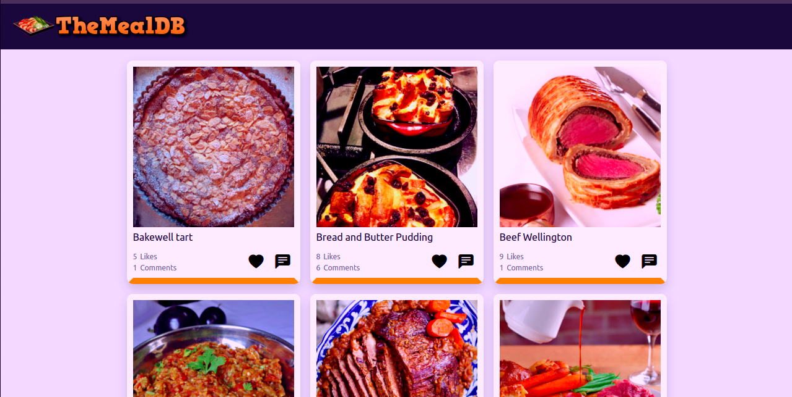

# javascript-capstone

> JavaScript Capstone Project to Build an API-based Web App

> This is a collaborative capstone proeject where the team is tasked to build a web app that displays list of food items form theMealsDB API.

## Live Demo
Click [here](https://francisuloko.github.io/javascript-capstone/dist/) to visit the app

## Built With

- JavaScript
- HTML & CSS
- webpack@5.44.0
- ES6
- bootstrap 5
- The Meals DB API

# API 
- [The Meals DB API](https://www.themealdb.com/api.php)
- [Microverse Involment API](https://www.notion.so/microverse/Involvement-API-869e60b5ad104603aa6db59e08150270)

## Prerequisites

- `browser`
- `vscode`
- `git`
- `jest`

## Clone Repo

To get a local copy up and running follow these simple steps:

   - `Open terminal Ctrl + Alt + T`

   - `git clone git@github.com:francisuloko/javascript-capstone.git`

   - `cd javascript-capstone`

   - `npm install`

   - `npm start`

   - `visit localhost:8080`

## Run the tests

- Install jest using yarn `yarn add --dev jest`
- Or install using npm `npm install --save-dev jest`
- Add the following section to your package.json: 
`{
  "scripts": {
    "test": "jest"
  }
}`
- How to run the tests: `npm run test` or `yarn test`
   

## Author

👤 **Francis Uloko**

- [GitHub](https://github.com/francisuloko)
- [Twitter](https://twitter.com/francisuloko)
- [LinkedIn](https://linkedin.com/in/francisuloko)

## 🤝 Contributing

Contributions, issues, and feature requests are welcome!

Feel free to check the [issues page](https://github.com/francisuloko/javascript-capstone/issues).

## Show your support

Give a ⭐️ if you like this project!

## Acknowledgments

- Microverse Inc.

## 📝 License

This project is [MIT](https://mit-license.org/) licensed.
